# CyberRakshak Vitta — Feature Dependency Map

Purpose: show exactly what blocks what, so `DEVELOPMENT_SEQUENCE.md` can order work correctly instead of by guesswork. Nodes marked ✅ are complete today; nodes marked 🔲 require work per `PRODUCT_ROADMAP.md`.

## Dependency graph

```mermaid
flowchart TB
    classDef done fill:#1f6f43,stroke:#0b3d24,color:#fff
    classDef todo fill:#7c3aed,stroke:#4c1d95,color:#fff
    classDef critical fill:#b5651d,stroke:#5c3317,color:#fff

    FAIR["FAIR Engine\n(impact/likelihood/engine/uncertainty)"]:::done
    PROV["Provenance + closed-loop trigger"]:::done
    FORECAST["Risk Forecasting"]:::done
    ATTACKPATH["Attack Path Financial Exposure"]:::done
    OPTIMIZER["MILP Optimizer + Pareto Sweep"]:::done
    SPENDCHART["SpendCurveChart"]:::done
    SIM["Scenario Engine"]:::done
    COMPLIANCE["Compliance Mapper"]:::done
    ORGBU["Organization/BusinessUnit schema + CRUD"]:::done
    IAM["IAM Connectors (Azure AD/Okta)"]:::done
    TOOLCALL["Tool-Calling Dispatch (rag_tools)"]:::done
    INTENT["Intent Classifier"]:::done
    RAG["RAG Retrieval"]:::done

    SCOPEFILTER["Org/BU Scope Filtering\non /risk/exposure, /risk/forecast"]:::critical
    NLUPARAMS["NLU Parameter Extraction\nfor tool-calling"]:::critical
    AUTHFIX["Auth default + secrets fix"]:::critical
    LOGIN["Login/session frontend"]:::todo

    BOARDPORTAL["BoardPortal.tsx"]:::todo
    SIMUI["ScenarioSimulator.tsx"]:::todo
    COMPUI["ComplianceCenter.tsx"]:::todo
    ACTIONBOARD["Investment Action Board"]:::todo
    ATTACKUI["AttackPath financial overlay"]:::todo
    DASHREFRAME["Dashboard money-first reframe"]:::todo
    EALCHART["EALTrendChart"]:::todo
    RADARCHART["ComplianceRadar"]:::todo
    TRACEUI["Tool-call trace UI"]:::todo
    CONNUI["Connector management UI"]:::todo
    RBAC["RBAC enforcement"]:::todo
    LIVETENANT["Live IAM tenant test"]:::todo

    FAIR --> PROV
    FAIR --> FORECAST
    FAIR --> ATTACKPATH
    FAIR --> OPTIMIZER
    FAIR --> SIM
    OPTIMIZER --> SPENDCHART

    ORGBU --> SCOPEFILTER
    FAIR --> SCOPEFILTER
    SCOPEFILTER --> BOARDPORTAL
    FORECAST --> EALCHART
    EALCHART --> DASHREFRAME
    COMPLIANCE --> RADARCHART
    COMPLIANCE --> COMPUI
    SIM --> SIMUI
    OPTIMIZER --> ACTIONBOARD
    ATTACKPATH --> ATTACKUI

    TOOLCALL --> NLUPARAMS
    INTENT --> NLUPARAMS
    TOOLCALL --> TRACEUI
    NLUPARAMS -->|"blocks a correct live demo\nof the copilot's core use case"| TRACEUI

    AUTHFIX --> LOGIN
    AUTHFIX --> RBAC
    LOGIN --> RBAC

    IAM --> LIVETENANT
    IAM --> CONNUI
    LIVETENANT -.->|"external dependency,\nnot code work"| CONNUI

    RAG -->|"verify index loads\nin demo environment"| TOOLCALL
```

## Critical-path dependencies (the three items that unblock the most downstream work)

| Blocking item | What it unblocks | Why it's not optional |
|---|---|---|
| **Org/BU scope filtering on `/risk/exposure`, `/risk/forecast`** | Board Portal (entirely), any BU-comparison chart | Board Portal cannot show "which BU drives the most risk" without this — it's a small backend change (query param + filter) that gates a large, high-visibility frontend build |
| **NLU parameter extraction for tool-calling** | A *correct* answer to the copilot's headline use case ("where should I invest ₹1 crore") | Everything else about the AI pipeline works; this one gap means the copilot currently answers every financial question against the same hardcoded ₹5L regardless of what's asked — a judge asking a specific number will notice immediately |
| **Auth default flip (`AUTH_DISABLED=False`) + secret rotation** | Login flow, RBAC, any judge-facing deployment credibility | Everything downstream of "who is the user" depends on this; it's also the one item on this whole map that's a genuine security exposure, not just an incomplete feature |

## Independent work streams (can be parallelized across team members)

These have no dependency on each other and can run concurrently once the critical-path items above are scheduled:

- **Stream 1 (Board/BU):** scope filtering → Board Portal
- **Stream 2 (Simulation):** Scenario Simulator UI (zero backend blockers, ready today)
- **Stream 3 (Compliance):** Compliance Center UI + ComplianceRadar (zero backend blockers, ready today)
- **Stream 4 (Investment):** Action Board UI (zero backend blockers, ready today)
- **Stream 5 (AI):** NLU parameter extraction → tool-call trace UI
- **Stream 6 (Security):** Auth fix → login flow → RBAC
- **Stream 7 (Dashboard):** EALTrendChart → money-first reframe (depends only on `/risk/forecast`, which is already live)
- **Stream 8 (Connectors):** Live IAM tenant test (blocked on obtaining a test tenant, an external/non-code dependency — start this immediately since it has the longest lead time of anything on this list)

## What has zero dependencies and should start first, regardless of team size

Scenario Simulator UI, Compliance Center UI, Action Board UI, and EALTrendChart all consume APIs that are live today with no blocking work of any kind. These four items should be the very first things picked up — see `DEVELOPMENT_SEQUENCE.md` Phase 1.
