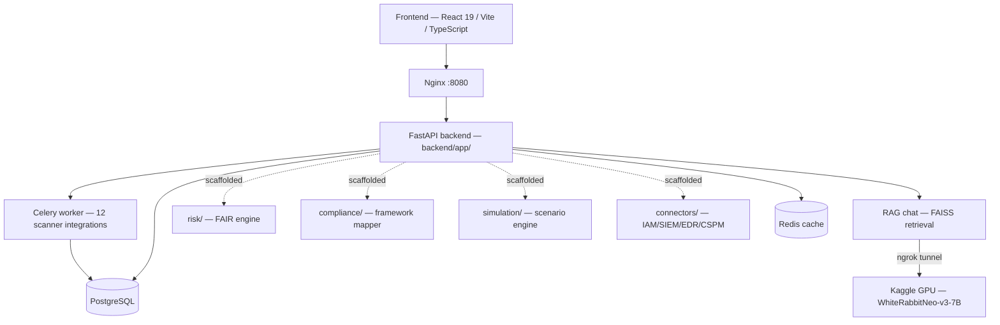

# CyberRakshak Vitta

**Continuous cyber risk, priced in rupees.** CyberRakshak Vitta converts live vulnerability scans and (soon) multi-source security telemetry into Expected Annual Loss, Value at Risk, and budget-constrained investment recommendations — for SIH26105, *AI-Powered Continuous Cyber Risk Quantification and Investment Optimization Platform*.

*Vitta* (वित्त) is Sanskrit/Hindi for "wealth/finance" — the name signals the platform's pivot from a technical vulnerability scanner to a financial risk-quantification system, while keeping the CyberRakshak brand this codebase was originally built under.

> **Honesty note before anything else:** this README describes the system as it actually is, split explicitly into what's implemented and what's scaffolded (interfaces defined, logic pending). Two earlier internal specs described a fully-built FAIR risk engine that did not exist in this codebase — see [`docs/audits/gap-audit.md`](docs/audits/gap-audit.md) for the full account. This document does not repeat that mistake.

---

## Product vision

Cyber risk is still mostly communicated as "Critical / High / Medium / Low" — labels that tell a CISO what to patch first but tell a CFO or board member nothing about whether the organization is spending the right amount, on the right things. CyberRakshak Vitta's job is to close that gap: every finding a scanner produces should ultimately resolve to a rupee figure a non-technical executive can act on, and every investment recommendation should come with a defensible, auditable reason it was ranked where it was.

**Who it's for:** a security team running scans and triaging findings (the Analyst Console — built today), a CISO or CFO deciding where to spend the next security budget (the Executive Dashboard and Investment Optimizer — partially built), and a board or compliance officer who needs a trustworthy trend line and audit evidence, not a vulnerability count (the Board Portal and Compliance Center — scaffolded, not yet live).

## Problem statement alignment (SIH26105)

| PS requirement | Status |
|---|---|
| Continuous risk quantification in monetary terms (EAL, VaR) | Scaffolded — `backend/app/risk/` defines the interface, math not yet implemented |
| Correlate vuln mgmt + SIEM + IAM + EDR + CSPM + asset inventory + threat intel | Vuln mgmt + threat intel implemented; SIEM/IAM/EDR/CSPM connectors scaffolded (`backend/app/connectors/`) |
| Budget-constrained investment optimization with diminishing-returns curves | Scaffolded — `backend/app/risk/optimizer.py` |
| Executive + technical dashboards | Technical (Analyst Console) implemented; executive/board screens scaffolded |
| Framework mapping (ISO 27001, NIST CSF, CIS, RBI CSF, SEBI CSCRF) + DPDP | Scaffolded — `backend/app/compliance/` |
| AI decision support with natural-language query + scenario simulation | Retrieval-only chat implemented; tool-calling and simulation scaffolded |

See [`docs/audits/gap-audit.md`](docs/audits/gap-audit.md) for the full, evidence-based version of this table.

## Architecture overview



Solid arrows are implemented and load-bearing today. Dotted arrows are scaffolded — the module exists with a defined interface, but calling it currently raises `NotImplementedError`. See [`DOCUMENTATION.md`](DOCUMENTATION.md) for the full architecture reference.

## Key capabilities

**Working today:**
- Multi-tool vulnerability scanning (Nmap, Nuclei, Nikto, ZAP, Wappalyzer, WhatWeb, Whois, Dirsearch, Wfuzz, Dalfox, Metasploit, OpenVAS) orchestrated asynchronously via Celery/RabbitMQ.
- Attack-graph visualization (React Flow, built from a NetworkX graph of hosts → ports → services → findings).
- Live threat-intel enrichment: NVD, CISA KEV, ExploitDB, AlienVault OTX.
- CyRa, a retrieval-augmented chat assistant grounded in a technical security corpus (CVE/NVD, MITRE ATT&CK, exploit databases, OWASP).
- A 3D interactive landing experience and role-based operational console.

**Scaffolded (interface defined, implementation pending — see the Roadmap):**
- FAIR risk quantification (EAL, VaR, Monte Carlo uncertainty, EPSS-weighted likelihood).
- Budget-constrained investment optimization (MILP) with a Pareto frontier.
- Scenario simulation ("what if we rolled out MFA everywhere").
- Compliance framework mapping (ISO 27001, NIST CSF, CIS, RBI, SEBI, DPDP).
- SIEM / IAM / EDR / CSPM telemetry connectors.
- LLM tool-calling so CyRa can answer financial questions from live computation instead of retrieved text.

## Technology stack

| Layer | Stack |
|---|---|
| Frontend | React 19, TypeScript 5.9, Vite 7.2, Tailwind CSS, React Flow, Three.js / React Three Fiber (landing page) |
| Backend | FastAPI, SQLModel, Celery, RabbitMQ, Redis, PostgreSQL |
| AI / RAG | FAISS (in-memory retrieval), WhiteRabbitNeo-v3-7B + nomic-embed-text-v1.5 on a remote Kaggle GPU via ngrok, Qdrant (provisioned, not yet integrated — see `docs/adr/0001-qdrant-adoption.md`) |
| Scanning | 12 dockerized security tools, orchestrated Docker-out-of-Docker from the Celery worker |
| Infrastructure | Docker Compose, Nginx |
| Planned (scaffolded modules) | PuLP (MILP optimizer), NumPy Monte Carlo, FIRST.org EPSS API, Fernet-encrypted connector credentials |

## Repository structure

```
CyberRakshak/
├── Frontend/                    React 19 + TypeScript + Vite SPA
│   └── src/
│       ├── pages/                Routed screens (Dashboard, ScanConsole, BoardPortal, ...)
│       ├── components/           hero/ landing/ sections/ dashboard/ scan/ attack/ chat/ ...
│       ├── layouts/              AppLayout (operational portal), LandingLayout (public site)
│       ├── router/                AppRouter.tsx
│       └── services/              api.ts, chatAssistant.ts
│
├── backend/                     FastAPI + Celery backend
│   ├── app/
│   │   ├── api.py                 All REST routes
│   │   ├── auth.py                JWT issuance
│   │   ├── models.py              SQLModel schema
│   │   ├── worker/                Celery app + scanner task orchestration
│   │   ├── utils/                 External API clients (NVD, CISA, AlienVault, AI service, mail)
│   │   ├── risk/                  SCAFFOLD — FAIR engine (impact, likelihood, engine, uncertainty,
│   │   │                          optimizer, attack_path, epss_client, forecasting, provenance, score)
│   │   ├── compliance/            SCAFFOLD — framework_mapper.py
│   │   ├── connectors/            SCAFFOLD — base_connector.py, mock_sources.py, iam/{azure_ad,okta}.py
│   │   ├── simulation/            SCAFFOLD — scenario_engine.py, scenario_library.py
│   │   ├── rag_tools/             SCAFFOLD — LLM tool-calling bindings
│   │   └── reports/               SCAFFOLD — audit_evidence_report.py
│   ├── tests/                    pytest suite (real smoke tests + skipped acceptance specs for scaffolds)
│   └── Dockerfile.*               One Dockerfile per service/scanner
│
├── ai_service/                  Offline RAG corpus builders + Kaggle GPU inference server
├── nginx/                       Reverse proxy config
├── docs/
│   ├── architecture/             Source specification documents
│   ├── audits/                   gap-audit.md — the authoritative current-state document
│   └── adr/                      Architecture decision records
├── docker-compose.yml
├── README.md                    This file
└── DOCUMENTATION.md             Full technical reference
```

## Development workflow

1. Read [`docs/audits/gap-audit.md`](docs/audits/gap-audit.md) before touching a module you didn't write — it tells you what's real.
2. Check [`docs/adr/`](docs/adr/) for open decisions that might affect your change.
3. Implementing a scaffolded module? Start from its docstring — every file under `risk/`, `compliance/`, `connectors/`, `simulation/`, `rag_tools/` cites the formula/spec section and roadmap phase it belongs to, and `backend/tests/test_risk_engine.py` has skipped acceptance tests waiting to be un-skipped.
4. See [`CONTRIBUTING.md`](CONTRIBUTING.md) for module-boundary rules (in particular: `risk/engine.py` is the single source of truth for EAL/VaR — `simulation/` must call into it, never re-derive independently).

## Setup instructions

**Prerequisites:** Docker and Docker Compose.

```bash
git clone https://github.com/TheARTIFICES/CyberRakshak.git
cd CyberRakshak
cp backend/.env.example backend/.env   # then edit — see the security note below
docker compose up --build
```

Services and ports:

| Service | Port | Notes |
|---|---|---|
| Nginx (entry point) | `8080` | Proxies `/` → Vite dev server, `/api/` → backend |
| Frontend (Vite dev server) | `5173` | Only via Nginx by default |
| Backend API | `8000` | Only via Nginx by default |
| PostgreSQL | `5433` (host) → `5432` (container) | |
| RabbitMQ management UI | `15672` | |
| Redis | `6379` | |
| Qdrant | `6333` | Provisioned, not yet wired into the backend — see `docs/adr/0001-qdrant-adoption.md` |

**⚠️ Before running anywhere reachable outside your own machine:** this repository's default configuration ships with `AUTH_DISABLED=True` and hardcoded default secrets in `backend/app/config.py`. Do not deploy this default configuration publicly — see [`SECURITY.md`](SECURITY.md) and Roadmap Phase 0 below.

To run the AI inference service (`ai_service/kaggle_brain.py`), it must be hosted separately on a GPU (a free-tier Kaggle notebook is what this project targets) and its public ngrok URL set as `AI_SERVICE_URL` in the backend's environment — this is an external dependency outside the Docker network by design.

## AI architecture

CyRa, the AI advisor, currently runs a single retrieval-augmented pipeline: a deterministic intent classifier (`backend/app/intent_classifier.py`) tags a query, FAISS retrieves relevant technical documents (CVE/NVD, MITRE ATT&CK, exploit databases, OWASP — built by the offline corpus scripts in `ai_service/`), and a remote LLM (WhiteRabbitNeo-v3-7B, security-domain-tuned, hosted on a Kaggle GPU) generates a grounded response.

**What's scaffolded and why it matters:** `backend/app/rag_tools/` defines a strictly read-only tool-calling layer — once implemented, a financial or what-if question ("where should we invest ₹1 crore") will route to a live function call against the risk/optimizer/simulation/compliance modules instead of being answered from retrieved text. This is deliberate: that answer doesn't exist in any document, and letting an LLM free-generate it risks a plausible-sounding fabricated number, which is worse for trust than an honest "not yet available."

Qdrant is provisioned as a planned durable vector store (FAISS remaining the in-memory hot cache) but is not yet integrated — see the ADR linked above before building on top of it.

## FAIR architecture

`backend/app/risk/` implements Factor Analysis of Information Risk (FAIR), an industry-standard risk quantification methodology:

```
SLE       = business_value_inr × exposure_factor
λ_LEF     = TEF × Vuln × (1 − ControlEff)
EAL       = λ_LEF × SLE
```

`TEF` (Threat Event Frequency), `Vuln` (vulnerability/susceptibility factor, CVSS + EPSS), and `ControlEff` (combined control effectiveness — **multiplicative** across controls: `1 − Π(1 − eff_i)`, not additive or averaged) are estimated in `likelihood.py`; `impact.py` owns exposure-factor estimation. `uncertainty.py` runs a Compound Poisson Monte Carlo (N = 10,000 simulated years) around the point estimate to produce percentile bounds and VaR. `optimizer.py` solves a 0-1 integer program for budget-constrained mitigation selection, with a Pareto frontier for the PS's "diminishing returns" requirement. `provenance.py` stamps every computed figure with a versioned, hashed record of its exact inputs.

Every module currently defines this interface with `NotImplementedError` bodies — see [`docs/audits/gap-audit.md`](docs/audits/gap-audit.md) Roadmap Phase 2 for the implementation plan, and `backend/tests/test_risk_engine.py` for the acceptance criteria each formula must satisfy.

## Compliance architecture

`backend/app/compliance/framework_mapper.py` maps `AssetControl` implementation data to six frameworks: ISO 27001 Annex A, NIST CSF 2.0, CIS Controls v8, RBI Cyber Security Framework, SEBI CSCRF, and DPDP Act 2023.

**Modeling constraint that matters:** RBI CSF and SEBI CSCRF are graded, tiered frameworks — not flat checklists. RBI requires board-approved policy, an independent CISO reporting line, 24/7 SOC, and DAKSH incident reporting; SEBI CSCRF is built on five resiliency goals (Anticipate, Withstand, Contain, Recover, Evolve) tiered by regulated-entity category. `SUM(controls_met) / SUM(total)` is explicitly the wrong model for these two and will not be implemented that way. DPDP compliance gaps additionally feed a penalty-exposure estimate (up to the ₹250 crore statutory cap) into `RiskSnapshot.regulatory_loss_inr` as a distinct line item, not blended into general loss estimates.

Scope discipline: an honestly-labeled partial mapping (10–15 key controls per framework) is the target, not a fabricated full-framework score.

## Roadmap

See [`docs/audits/gap-audit.md`](docs/audits/gap-audit.md) for the complete phase-by-phase roadmap with dependencies. Summary:

`Phase 0` Stabilize (auth, secrets, Qdrant/Grype decisions) → `Phase 1` Data foundation (Org/BU, real Asset persistence) → `Phase 2` FAIR engine → `Phase 3` IAM connector (parallel with Phase 2) → `Phase 4` Attack-path analytics + optimizer → `Phase 5` Scenario simulation → `Phase 6` AI tool-calling → `Phase 7` Compliance engine → `Phase 8` Frontend build-out (live data for Board Portal/Simulator/Compliance Center, real auth) → `Phase 9` Governance polish.

## Contribution guide

See [`CONTRIBUTING.md`](CONTRIBUTING.md) for repository conventions, module-boundary rules, and testing expectations. See [`CODE_OF_CONDUCT.md`](CODE_OF_CONDUCT.md) for community standards and [`SECURITY.md`](SECURITY.md) for reporting vulnerabilities. Licensed under [MIT](LICENSE) — see that file for the license the maintainers should confirm before any public release.
